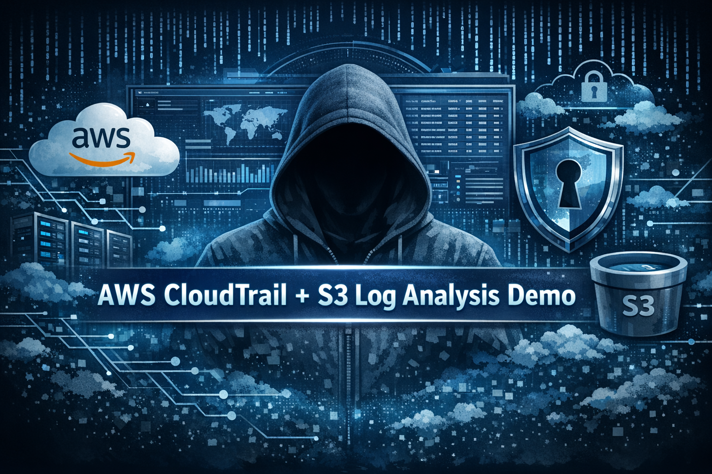
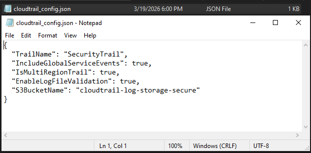
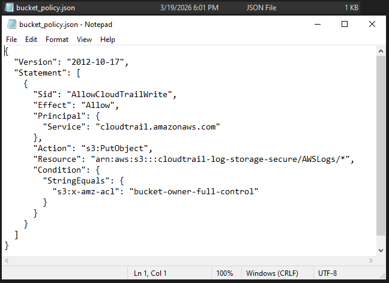
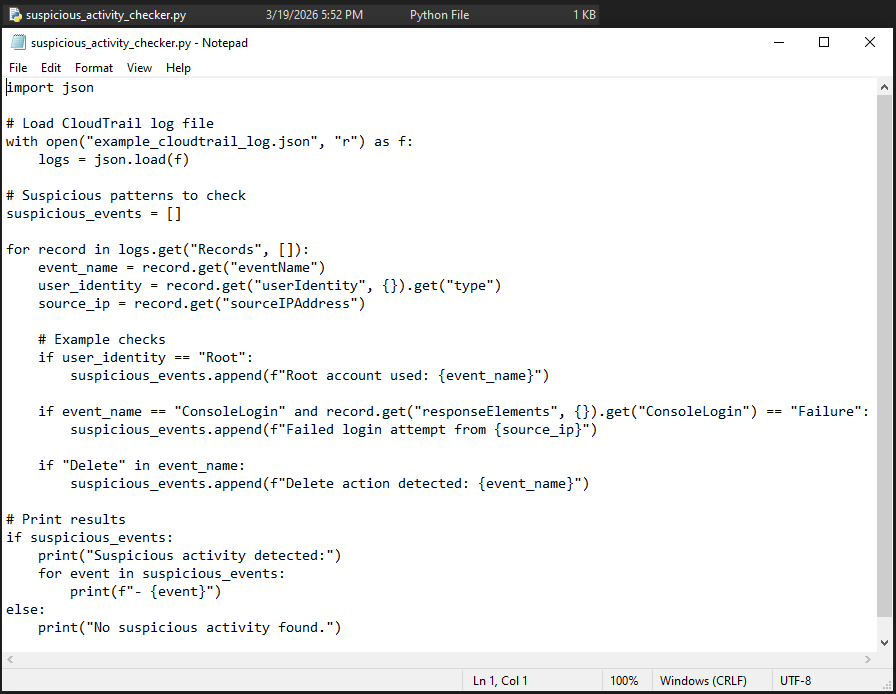
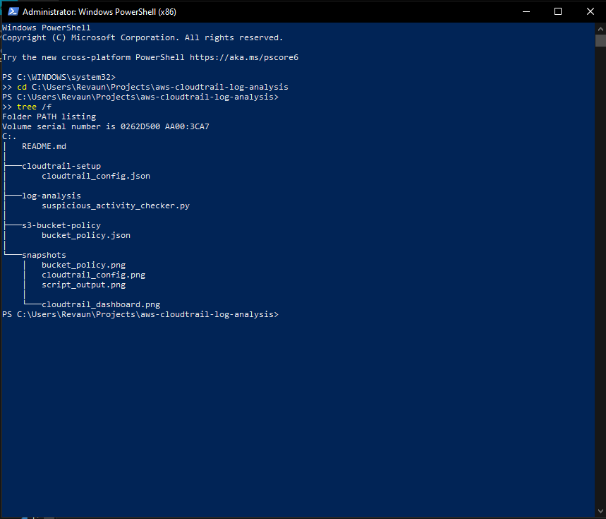

# 🛡️ AWS CloudTrail + S3 Log Analysis Demo



## 📌 Project Overview
This project demonstrates secure logging and monitoring in AWS using **CloudTrail** and **S3**.  
A Python script analyzes CloudTrail logs for suspicious activity such as root account usage, failed logins, and delete actions.  
Snapshots are included to provide recruiter‑ready proof of setup, security policies, and analysis results.

---

## 📂 Project Structure
- `cloudtrail-setup/cloudtrail_config.json` → CloudTrail configuration  
- `s3-bucket-policy/bucket_policy.json` → Secure S3 bucket policy  
- `log-analysis/suspicious_activity_checker.py` → Python log analysis script  
- `snapshots/` → Proof screenshots with captions  
- `README.md` → Project documentation  

---

## 🖼 Snapshots

### CloudTrail Setup
  
*CloudTrail configuration enforcing multi‑region logging and validation.*

### S3 Bucket Policy
  
*Secure S3 bucket policy allowing CloudTrail write access with least privilege.*

### Python Script Output
  
*Suspicious activity report — root usage, failed logins, and delete actions flagged.*

### Repo Structure
  
*Organized project structure with setup, policies, analysis script, and snapshots.*

### README Preview
  
*Recruiter‑ready README with setup steps and project summary.*

---

## 🚀 How to Run
1. Clone the repo:  
   ```bash
   git clone https://github.com/<your-username>/aws-cloudtrail-log-analysis.git

Navigate into the folder:
cd aws-cloudtrail-log-analysis/log-analysis

Run the script with a sample log file:
python suspicious_activity_checker.py

---

🛠 Skills Demonstrated

    AWS CloudTrail

    AWS S3

    Log Analysis

    Python

    Cloud Security


---


🎯 Value

This project highlights practical cloud security monitoring skills:

    Configuring secure logging with CloudTrail

    Enforcing least‑privilege policies in S3

    Detecting suspicious activity with Python analysis

    Presenting proof snapshots in a clean, professional repo